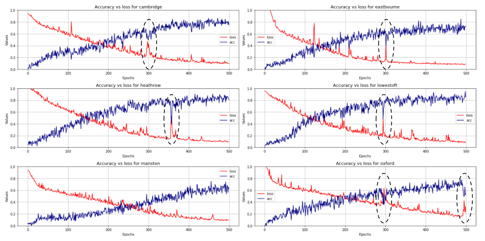

# Python-Dash-LSTM-rainfall

-
# Table of contents
- [1. Rationale](#1-rationale)
- [2. Architecture](#2-architecture)
- [3. Snapshots](#3-snapshots)

<i><a href='http://ecotrust-canada.github.io/markdown-toc/'>Table of contents generated with markdown-toc</a></i>

## 1. Rationale

-

## 2. Architecture

-

## 3. Snapshots
- **Rainfall time series for the 6 locations**.   
These represent monthly average rainfall in mm from January 2000 to September 2021.
 
- **Accuracy vs Loss as measured during training for the 6 locations**. 
The areas circled in black represent batches of data where the model failed to perform with the same accuracy. The reason for this is most likely in the physical process behind the data collection: when extreme events occur, such as [severe storms](https://en.wikipedia.org/wiki/Extreme_weather), the rainfall measurements can be many times larger than the average values. Also, because these events are few and far between, it becomes difficult for a model to take them into account, and they end up being assimilated as noise. This noise affects the ability of the model to generalise, leading to poorer predictions. 
 
- **Model evaluation: predictions vs measurered values for the 6 locations**. 
  - The comparison below shows that the LSTM models used for predicting monthly average rainfall can be improved. The options available are: (1) vary the number of hidden layers; (2) extend the training time series from 10 years to 15 or 20 years; (3) change model. 
  - Lowestoft seems to be the location where the model performs best: the Root Mean Squared Error ([RMSE](https://en.wikipedia.org/wiki/Root-mean-square_deviation)), which is used as a way of assessing the average distance between the predicted and the observed values, is the lowest recorded (35.81 mm over 2 years' worth of data). 
  - Overall, the LSTM models used seem to capture the trends most of the times. When the observed values peak, the models have a mixed behaviour: at times they don't respond well to spikes (see bottom right, Oxford, October 2020), while in other situations they do (see top right, Eastbourne, January 2021). This is probably due to the fact that the models need further tuning.  
 
