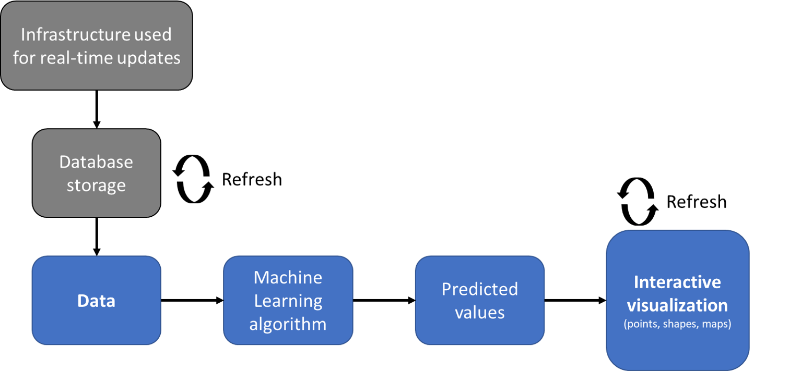

# Python-Streamlit-LSTM-rainfall

-
# Table of contents
- [1. Rationale](#1-rationale)
- [2. Architecture](#2-architecture)
- [3. Snapshots](#3-snapshots)
- [4. App](#4-app)

<i><a href='http://ecotrust-canada.github.io/markdown-toc/'>Table of contents generated with markdown-toc</a></i>

## 1. Rationale
For so long, consultants operating in the fields of Civil Engineering, Environment and Geosciences have relied on obsolete and static tools to deliver their work: `spreadsheets`.

These files, however, although considered stable and part of the gold-standard, are struggling to keep up with the fast-paced world of data storage and visualizations, and come with a series of disadvantages:
- **Staticity**: updating these files is very often a manual process
- **Maintenance**: spreadsheets are difficult to maintain and document in the absence of a script that defines exactly the formulas used and assumptions made
- **Consistency**: these tools can be customised by each user, leading to inconsistencies and lack of understanding when the files are passed on to colleagues and/or clients
- **Versioning**: older versions are always supported by the newr ones, but the newer versions are almost never backported, leading to files becoming unreadable
- **Storage**: these files are often found in multiple locations, making it difficult to map where they are
- **Accessibility**: often, the data stored in spreadsheets do not have a consistent schema, are of different data types, and are difficult to access
- **Upscaling**: the performance of spreadsheets is known to suffer dramatically from any increase in size
- **Auditing**: as these files almost always come with hand-written formulas present in multiple cells, it is difficult to check their accuracy as well as the flowchart followed
- **Predictions**: being spreadsheet-based means that the data, even if in pristine state, are troublesome to be processed by a Machine Learning algorithm to provide predictions due to the difficulty in backporting ML algorithms to a non-native language (for example, from Python to Microsoft Excel)

For these reasons, this page offers an alternative solution where all the problems listed above are solved: an interactive app built with Python and [Streamlit](https://streamlit.io/). The architecture of the solution itself is quite simple:
1. Obtain, pre-process, and load data
2. Train Machine Learning algorithm
3. Obtain predicted values
4. Display historic and predicted values using an interactive dashboard which can also be updated in real time 
 

## 2. Architecture
The predictions were obtained using a particular type of Recurrent Neural Networks known as Long-Short Term Memory ([LSTM](https://en.wikipedia.org/wiki/Long_short-term_memory)). Its architecture makes it a suitable algorithm to use in sequence-to-sequence problems, as is the case with predicting rainfall.

The image below shows a high-level representation of the architecture of this network. The idea is that the network receives an input vector *i* and returns an output vector *o*. The LSTM box is composed of a sequence of network chunks processing the data. The operations that happen within each chunk involve remembering values over arbitrary time intervals (e.g., the Memory) as well as using state functions that allow data and gradients to move on to the next chunk. A more detailed explanation is available [here](https://colah.github.io/posts/2015-08-Understanding-LSTMs/). 
 

The image below shows the steps used to obtain the rainfall predictions. The crucial part is to specify the length of segments **1** and **2**. In other words, this means specifying how many *n past values* are needed by the network to predict *m future values*. These parameters are defined in the network set-up, and in the case of this app, the following values were used:
- Past values: `n=120`
- Future values: `m=24`

This means that the LSTM network needs 120 historical values to predict 24 future values. Given that the the network was fed monthly average rainfall values, `n` corresponds to 10 years and `m` corresponds to 2 years. So, the network needs 10 years' worth of data to predict the next 2 years, which entails that segment **3** is also 24 values or 2 years in length.

 

## 3. Snapshots
- **Rainfall time series for the 6 locations**.   
These represent monthly average rainfall in mm from January 2000 to September 2021.
 
- **Accuracy vs Loss as measured during training for the 6 locations**. 
The areas circled in black represent batches of data where the model failed to perform with the same accuracy. The reason for this is most likely in the physical process behind the data collection: when extreme events occur, such as [severe storms](https://en.wikipedia.org/wiki/Extreme_weather), the rainfall measurements can be many times larger than the average values. Also, because these events are few and far between, it becomes difficult for a model to take them into account, and they end up being assimilated as noise. This noise affects the ability of the model to generalise, leading to poorer predictions. 
 
- **Model evaluation: predictions vs measurered values for the 6 locations**. 
  - The comparison below shows that the LSTM models used for predicting monthly average rainfall can be improved. The options available are: (1) vary the number of hidden layers; (2) extend the training time series from 10 years to 15 or 20 years; (3) change model. 
  - Lowestoft seems to be the location where the model performs best: the Root Mean Squared Error ([RMSE](https://en.wikipedia.org/wiki/Root-mean-square_deviation)), which is used as a way of assessing the average distance between the predicted and the observed values, is the lowest recorded (35.81 mm over 2 years' worth of data). 
  - Overall, the LSTM models used seem to capture the trends most of the times. When the observed values peak, the models have a mixed behaviour: at times they don't respond well to spikes (see bottom right, Oxford, October 2020), while in other situations they do (see top right, Eastbourne, January 2021). This is probably due to the erratic behaviour of rainfall extremes, which are difficult to model using a univariate approach like this (e.g., the only predictor used in this example is the rainfall itself; multivariate approaches would use additional variables such as elevation, latitude, wind, humidity, etc.).  
 

## 4. App
The structure of this app is shown in the image below.
 
